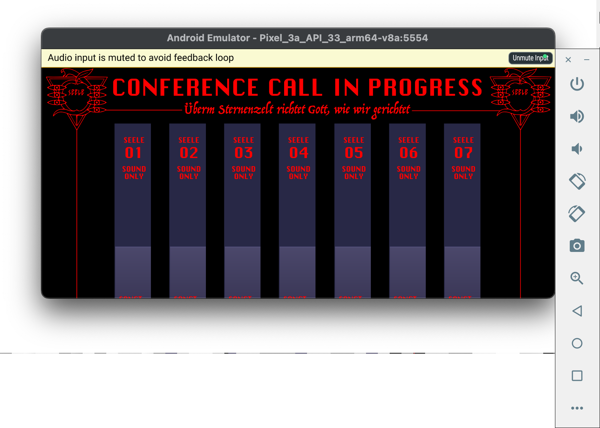

It is an attempt to port of [ZEELE plugin](https://github.com/SimonZimmer/SEELE) to [AAP (Audio Plugins For Android)](https://github.com/atsushieno/aap-core) using [aap-juce](https://github.com/atsushieno/aap-juce)... just for fun!

Actually it's still not working (`JUCE Assertion failure in juce_LookAndFeel.cpp:73`) a few more fix would be needed.

